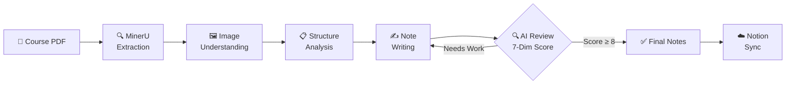

# Lecture Notes Creator — AI-Powered PDF-to-Notes for Students

**[中文文档](README_ZH.md) | [English](README.md)**

[](LICENSE)
[](https://www.python.org/)
[](https://github.com/opendatalab/MinerU)

> Turn confusing course PDFs into clear, page-by-page self-study notes — with AI extraction, structured writing, and iterative quality review.

## How It Works



## Why Lecture Notes Creator?

Staring at a 200-page course PDF the night before the exam? We've been there.

Most students either:
- **Read passively** — highlight everything, remember nothing
- **Copy-paste slides** — end up with the same confusing content in a different format

Lecture Notes Creator takes a different approach:

| Traditional | Lecture Notes Creator |
|---|---|
| Dense slides with abbreviations | Step-by-step explanations with full context |
| Skipped derivations ("obviously...") | Complete reasoning chains from intuition to math |
| No way to check coverage | Page-by-page mapping — every slide accounted for |
| One-pass reading | Multi-round AI review until quality threshold is met |

## Key Features

- 🔬 **High-Fidelity Extraction** — MinerU VLM mode preserves formulas (LaTeX), tables (HTML), and figures from any PDF
- 📖 **Page-Driven Structure** — Notes strictly follow P1→P2→P3 order; every page mapped, nothing missed
- 🧠 **Adaptive Writing Styles** — Traditional courses (physics/chem): analogy → derivation → meaning; Slide-based (CS/AI): motivation → mechanism → application
- 🔄 **AI Review Loop** — 7-dimension scoring by a sub-agent playing an undergraduate student; iterates until ≥8/10
- ☁️ **One-Click Notion Sync** — Push notes to your Notion workspace with proper formatting

## Quick Start

> 📖 Full installation guide: [INSTALLATION.md](docs/INSTALLATION.md) | Quick start: [QUICKSTART.md](docs/QUICKSTART.md)

### Prerequisites

- Python 3.10+
- MinerU API Key (from [mineru.net](https://mineru.net/))
- (Optional) Notion API Key

### Install

```bash
git clone https://github.com/ZelinZHOU-THU/lecture-notes-creator.git
cd lecture-notes-creator
pip install -r requirements.txt
```

Configure your `.env` file:

```env
MINERU_TOKEN=your_mineru_api_key_here
NOTION_API_KEY=your_notion_api_key_here  # Optional
```

Then open the project in [OpenCode](https://opencode.ai) and give it your PDF. That's it.

<details>
<summary>📖 Detailed usage steps</summary>

1. **Analyze PDF** (optional, only needed if >200 pages)
   ```bash
   python scripts/split_pdf.py analyze "path/to/courseware.pdf" --preview 3
   ```

2. **Extract content** (generates .bat file, double-click to run)
   ```bash
   python scripts/create_extraction_bat.py "path/to/courseware.pdf" --output ./output_dir/mineru --mode auto
   ```

3. **Tell OpenCode "extraction done"** — it checks status and continues

4. **Sub-agent analyzes images** (optional, recommended for image-heavy PDFs)

5. **OpenCode handles the rest**:
   - Identifies courseware type (traditional / slide-based)
   - Writes lecture notes page by page
   - Each chapter goes through AI review iteration
   - Optionally uploads to Notion

</details>

## Project Structure

```
lecture-notes-creator/
├── SKILL.md                          # Skill definition (core workflow)
├── .opencode/agents/
│   ├── lecture-reviewer.md           # Sub-agent: quality review
│   └── image-describer.md            # Sub-agent: image understanding
├── scripts/
│   ├── split_pdf.py                  # PDF analyze / pre-split / merge
│   ├── extract_pdf.py                # Page screenshots (fallback)
│   ├── mineru_extract.py             # MinerU API calls
│   ├── create_extraction_bat.py      # Generate .bat for extraction
│   ├── reconstruct_full_md.py        # Rebuild Markdown from JSON
│   ├── backfill_image_descriptions.py
│   └── save_batch_json.py
├── docs/
│   ├── INSTALLATION.md               # Full installation guide (zh/en)
│   └── QUICKSTART.md                 # Quick start guide (zh/en)
└── references/
    ├── writing-style-guide.md        # Writing style reference
    └── review-prompt.md              # Review prompt template
```

## Credits

Built with:

- [MinerU](https://github.com/opendatalab/MinerU) — High-fidelity PDF extraction (Modified Apache License 2.0)
- [OpenClaw Notion Skill](https://github.com/openclaw/openclaw/tree/main/skills/notion) — Notion API integration (MIT License)
- [LobeHub MinerU Skill](https://lobehub.com/zh/skills/openclaw-skills-mineru) — Skill reference (MIT License)

## License

[Apache License 2.0](LICENSE)
