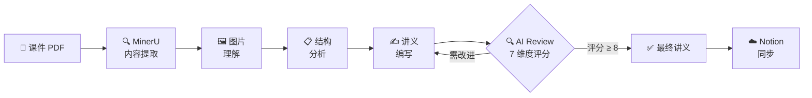

# Lecture Notes Creator — AI 驱动的课件转讲义工具

**[中文文档](README_ZH.md) | [English](README.md)**

[](LICENSE)
[](https://www.python.org/)
[](https://github.com/opendatalab/MinerU)

> 将晦涩的课件 PDF 转化为清晰的逐页自学讲义 —— AI 提取 + 结构化写作 + 迭代质量审查。

## 工作流程



## 为什么需要 Lecture Notes Creator？

考试前一晚对着 200 页课件 PDF 发呆？我们都经历过。

大多数同学要么：
- **被动阅读** — 画了一堆高亮，什么都没记住
- **复制粘贴幻灯片** — 换了个格式，内容一样看不懂

Lecture Notes Creator 用不同的方式解决问题：

| 传统方式 | Lecture Notes Creator |
|---|---|
| 密密麻麻的缩写和符号 | 循序渐进的完整解释 |
| 推导跳步（"显然可得..."） | 从直觉到数学的完整推理链 |
| 不知道覆盖了哪些内容 | 逐页映射 —— 每一页课件都有对应讲义 |
| 看一遍就过 | AI 多轮审查，直到质量达标 |

## 核心功能

### 🔬 高保真内容提取
MinerU VLM 模式完整保留公式（LaTeX）、表格（HTML）和图片。不再有公式乱码或文本错位。

### 📖 页码驱动结构
讲义严格按 P1→P2→P3 顺序组织。每页必现，方便对照原始课件快速定位。

### 🧠 自适应写作风格
传统课件（物理/化学）按直觉类比 → 数学推导 → 物理意义组织。幻灯片课件（CS/AI）按问题动机 → 核心机制 → 应用意义组织。LLM 自动检测适合你 PDF 的风格。

### 🔄 AI Review 迭代
子智能体模拟本科生视角，对每章进行 7 维度评分。循环迭代直到评分 ≥8/10 — 通常 1-2 轮即可达标。

### ☁️ 一键同步 Notion
将讲义推送到 Notion 工作区，自动处理标题、LaTeX、表格和标注等格式。无需手动排版。

## 快速开始

> 📖 完整安装指南：[INSTALLATION.md](docs/INSTALLATION.md)（[English](docs/INSTALLATION_EN.md)） | 快速开始：[QUICKSTART.md](docs/QUICKSTART.md)（[English](docs/QUICKSTART_EN.md)）

### 前置条件

- Python 3.10+
- MinerU API Key（从 [mineru.net](https://mineru.net/) 获取）
- （可选）Notion API Key

### 安装

```bash
git clone https://github.com/ZelinZhou-THU/lecture-notes-creator.git
cd lecture-notes-creator
pip install -r requirements.txt
```

配置 `.env` 文件：

```env
MINERU_TOKEN=your_mineru_api_key_here
NOTION_API_KEY=your_notion_api_key_here  # 可选
```

然后在 [OpenCode](https://opencode.ai) 中打开项目，把 PDF 丢给它就行。

<details>
<summary>📖 详细使用步骤</summary>

1. **分析 PDF**（可选，超过 200 页才需要）
   ```bash
   python scripts/split_pdf.py analyze "path/to/courseware.pdf" --preview 3
   ```

2. **提取内容**（生成 .bat 文件，双击运行）
   ```bash
   python scripts/create_extraction_bat.py "path/to/courseware.pdf" --output ./output_dir/mineru --mode auto
   ```

3. **告诉 OpenCode "提取完成"** — 它会检查状态并继续

4. **子智能体分析图片**（可选，图片多时建议开启）

5. **OpenCode 自动完成剩余流程**：
   - 识别课件类型（传统分节式 / 幻灯片式）
   - 逐页编写讲义
   - 每章经过 AI Review 迭代优化
   - 可选上传到 Notion

</details>

## 项目结构

```
lecture-notes-creator/
├── SKILL.md                          # 技能定义文件（核心工作流）
├── .opencode/agents/
│   ├── lecture-reviewer.md           # 子智能体：讲义质量审查
│   └── image-describer.md            # 子智能体：图片理解
├── scripts/
│   ├── split_pdf.py                  # PDF 分析 / 预切分 / 合并
│   ├── extract_pdf.py                # 页面截图（备用方案）
│   ├── mineru_extract.py             # MinerU API 调用
│   ├── create_extraction_bat.py      # 生成 .bat 提取脚本
│   ├── reconstruct_full_md.py        # 从 JSON 重建 Markdown
│   ├── backfill_image_descriptions.py
│   └── save_batch_json.py
├── docs/
│   ├── INSTALLATION.md               # 安装指南（中文）
│   ├── INSTALLATION_EN.md            # 安装指南（英文）
│   ├── QUICKSTART.md                 # 快速开始（中文）
│   └── QUICKSTART_EN.md             # 快速开始（英文）
└── references/
    ├── writing-style-guide.md        # 写作风格参考
    └── review-prompt.md              # Review 提示词模板
```

## 致谢

本项目基于以下开源组件构建：

- [MinerU](https://github.com/opendatalab/MinerU) — 高保真 PDF 内容提取（Modified Apache License 2.0）
- [OpenClaw Notion Skill](https://github.com/openclaw/openclaw/tree/main/skills/notion) — Notion API 集成（MIT License）
- [LobeHub MinerU Skill](https://lobehub.com/zh/skills/openclaw-skills-mineru) — 技能封装参考（MIT License）

## License

[Apache License 2.0](LICENSE)
